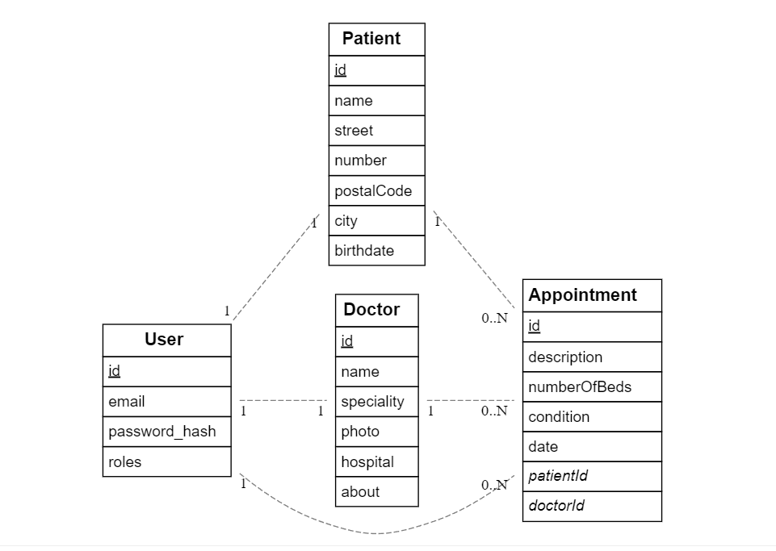
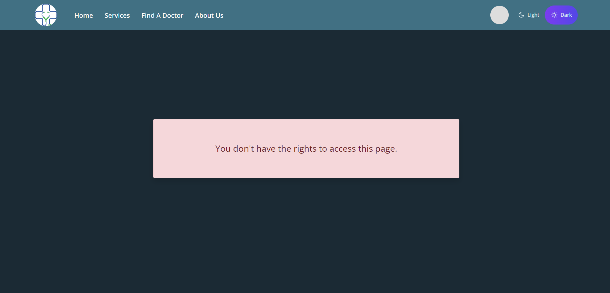
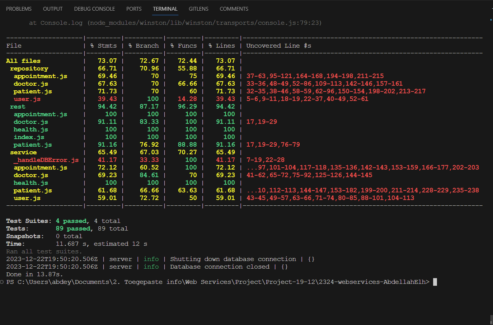

# Abdellah El Halimi Merroun (202291491)

- [x] Front-end Web Development
  - https://github.com/Web-IV/2324-frontendweb-AbdellahElh
  - https://appointment-app-web-2023-24.onrender.com
- [x] Web Services: GITHUB URL
  - https://github.com/Web-IV/2324-webservices-AbdellahElh
  - https://appointment-app-2023-24.onrender.com

**Logingegevens admin**

- Gebruikersnaam/e-mailadres: abdellah.elhalimimerroun@student.hogent.be
- Wachtwoord: 12345678

**Logingegevens patient**

- Gebruikersnaam/e-mailadres: emily.smith@gmail.com
- Wachtwoord: 12345678

**Logingegevens doctor**

- Gebruikersnaam/e-mailadres: olivia.anderson@gmail.com
- Wachtwoord: 12346578

## Projectbeschrijving

Dit project betreft de ontwikkeling van een interactieve website voor een medische kliniek. De website biedt patiënten de mogelijkheid om een account aan te maken en afspraken te plannen met artsen die bij de kliniek werken. Patiënten kunnen de verschillende diensten bekijken die de kliniek aanbiedt en artsen zoeken op basis van specialiteit of naam. Na het bekijken van de profielen van de artsen, kunnen patiënten de arts kiezen die het beste bij hun behoeften past en een afspraak maken.

Daarnaast bevat de website een aparte pagina met informatie over het bedrijf. Er is ook een contactformulier beschikbaar voor patiënten om rechtstreeks contact op te nemen met het bedrijf. Een extra functie van de website is de mogelijkheid voor gebruikers om te schakelen tussen een lichte en donkere modus, afhankelijk van hun voorkeur.

## Entitieiten

### User

- `id`
- `email`
- `password_hash`
- `roles`

### Patient

- `id`
- `name`
- `street`
- `number`
- `postalCode`
- `city`
- `birthdate`

### Doctor

- `id`
- `name`
- `speciality`
- `photo`
- `hospital`
- `about`

### Appointment

- `id`
- `description`
- `numberOfBeds`
- `condition`
- `date`
- `patientId`
- `doctorId`

## Relaties

- User 1:1 Patient
- User 1:1 Doctor
- User 1:\* Appointment
- Patient 1:\* Appointment
- Doctor 1:\* Appointment

## ERD Diagram



## Screenshots

#### Een patient kan de gegevens van de artsen en patienten niet bekijken als hij geen admin is



## API calls

### Appointments

- `GET /api/appointment`: alle appointments ophalen
- `GET /api/appointment/:id`: appointment met een bepaald id ophalen
- `POST /api/appointment`: create appointment

```json
{
  "description": "Toothache and cavity",
  "numberOfBeds": 3,
  "condition": "Chest pain and shortness of breath",
  "date": "2023-11-15T08:15:00.000Z",
  "patientId": 1,
  "doctorId": 11
}
```

- `PUT /api/appointment/:id`: update appointment

```json
{
  "id": 18,
  "description": "new description",
  "numberOfBeds": 30,
  "condition": "Chest pain and shortness of breath",
  "date": "2023-11-15T08:15:00.000Z",
  "patient": {
    "id": 1,
    "name": "Emily Smith"
  },
  "doctor": {
    "id": 11,
    "name": "Dr. Michael Brown Smith"
  }
}
```

- `DELETE /api/appointment/:id`: delete appointment

### Doctors

- `GET /api/doctors`: alle dokters ophalen
- `GET /api/doctors/:id`: dokter met een bepaald id ophalen
- `POST /api/doctors/register`: register a doctor

```json
{
  "email": "testRender2@example.com",
  "password": "12345678",
  "name": "Test Render"
}
```

- `POST /api/doctors/login`: login a doctor

```json
{
  "email": "olivia.anderson@gmail.com",
  "password": "12345678"
}
```

- `PUT /api/doctors/:id`: update doctor

```json
{
  "name": "Olivia Anderson 2",
  "email": "olivia.anderson2@gmail.com",
  "speciality": "new speciality",
  "photo": "../assets/imgs/doc1.jpg",
  "hospital": "AZ Groeninge",
  "about": "Dr. Olivia Anderson is a dedicated and experienced cardiologist, currently practicing at AZ Groeninge. With a patient-first approach, she has successfully treated numerous patients, earning a 5-star rating. Her commitment to her profession is reflected in the positive health outcomes of her patients. She continually strives to provide the best cardiac care, keeping herself updated with the latest in cardiology."
}
```

- `DELETE /api/doctors/:id`: delete doctor

### Patients

- `GET /api/patients`: alle patienten ophalen
- `GET /api/patients/:id`: patient met een bepaald id ophalen
- `POST /api/patients/register`: register a patient

```json
{
  "email": "patient@example.com",
  "password": "password123",
  "name": "New patient"
}
```

- `POST /api/patients/login`: login a patient

```json
{
  "email": "emily.smith@gmail.com",
  "password": "12345678"
}
```

- `PUT /api/patients/:id`: update patient

```json
{
  "name": "Changed name",
  "email": "changedEmail@gmail.com",
  "street": "789 Oak Street",
  "number": "Apt 3V",
  "postalCode": "54321",
  "city": "Metropolitan City",
  "birthdate": "2001-10-01T00:00:00.000Z"
}
```

- `DELETE /api/patients/:id`: delete patient

## Behaalde minimumvereisten

### Front-end Web Development

- **componenten**

  - [x] heeft meerdere componenten - dom & slim (naast login/register)
  - [x] applicatie is voldoende complex
  - [x] definieert constanten (variabelen, functies en componenten) buiten de component
  - [x] minstens één form met meerdere velden met validatie (naast login/register)
  - [x] login systeem
        <br />

- **routing**

  - [x] heeft minstens 2 pagina's (naast login/register)
  - [x] routes worden afgeschermd met authenticatie en autorisatie
        <br />

- **state-management**

  - [x] meerdere API calls (naast login/register)
  - [x] degelijke foutmeldingen indien API-call faalt
  - [x] gebruikt useState enkel voor lokale state
  - [x] gebruikt gepast state management voor globale state - niet van toepassing
        <br />

- **hooks**

  - [x] gebruikt de hooks op de juiste manier
        <br />

- **varia**

  - [x] een aantal niet-triviale e2e testen
  - [x] minstens één extra technologie
  - [x] maakt gebruik van de laatste ES-features (async/await, object destructuring, spread operator...)
  - [x] duidelijke en volledige README.md
  - [x] volledig en tijdig ingediend dossier en voldoende commits

### Web Services

- **datalaag**

  - [x] voldoende complex (meer dan één tabel, 2 een-op-veel of veel-op-veel relaties)
  - [x] één module beheert de connectie + connectie wordt gesloten bij sluiten server
  - [x] heeft migraties - indien van toepassing
  - [x] heeft seeds
        <br />

- **repositorylaag**

  - [x] definieert één repository per entiteit (niet voor tussentabellen) - indien van toepassing
  - [x] mapt OO-rijke data naar relationele tabellen en vice versa - indien van toepassing
        <br />

- **servicelaag met een zekere complexiteit**

  - [x] bevat alle domeinlogica
  - [x] bevat geen SQL-queries of databank-gerelateerde code
        <br />

- **REST-laag**

  - [x] meerdere routes met invoervalidatie
  - [x] degelijke foutboodschappen
  - [x] volgt de conventies van een RESTful API
  - [x] bevat geen domeinlogica
  - [x] geen API calls voor entiteiten die geen zin hebben zonder hun ouder (bvb tussentabellen)
  - [x] degelijke authorisatie/authenticatie op alle routes
        <br />

- **algemeen**

  - [x] er is een minimum aan logging voorzien
  - [x] een aantal niet-triviale integratietesten (min. 1 controller >=80% coverage)
  - [x] minstens één extra technologie
  - [x] maakt gebruik van de laatste ES-features (async/await, object destructuring, spread operator...)
  - [x] duidelijke en volledige README.md
  - [x] volledig en tijdig ingediend dossier en voldoende commits

## Projectstructuur

### Front-end Web Development

Onder de `src` directory vind je slechts twee bestanden: `index.css` en `main.jsx`, en vier mappen: `api`, `components`, `pages` en `contexts`.

- In de `api` map bevindt zich alleen `index.js` waarin de API-calls zijn gedefinieerd.

- Voor de `components` map en de `pages` map, voor elke component of pagina is er een aparte map met daarin het bijbehorende CSS-bestand. Alle classNames in de JSX-bestanden volgen de BEM-conventie voor overzichtelijke en herbruikbare stijlen, behalve ‘SliderToggle’, die de Tailwind-conventie volgt.

- De `contexts` map bevat `Auth.context.jsx` voor authenticatie en `Theme.context.jsx` voor themabeheer.

### Web Services

Mijn applicatie is gestructureerd in verschillende mappen en bestanden. Hier is een overzicht:

`src`: De hoofdmap bevat de volgende bestanden en mappen:

- `createServer.js`: Dit bestand bevat een functie om een server te maken en te starten. Het handelt ook server sluitingsevents af.
- `index.js`: Dit bestand roept de main functie aan die gedefinieerd is in `createServer.js`.
- `core`: Deze map bevat verschillende JavaScript-bestanden gerelateerd aan authenticatie, logging, rollenbeheer etc.
- `data/migrations`: Deze map bevat bestanden die databasemigraties definiëren.
- `data/seeds`: Deze map bevat bestanden die databaseseeds definiëren.
- `repository`: Deze map bevat bestanden die de data-access laag van de applicatie definiëren.
- `REST`: Deze map bevat bestanden die de RESTful API routes of controllers definiëren.
- `service`: Deze map bevat service-gerelateerde (business) logica.

Mijn applicatie heeft ook een `test`-map met:

- `common/auth.js`: Bevat methoden voor het testen van autorisatieheaders.
- `supertest.setup.js`: Bevat methoden voor het testen van authenticatie en server setup.
- `global.setup.js` en `global.teardown.js`: Voor het initialiseren en opruimen van gegevens.
- Naast ook de REST test bestanden voor het testen van de RESTful API routes en service-gerelateerde logica.

## Extra technologie

### Front-end Web Development

- `react-error-boundary` voor het afhandelen van fouten in React-componenten.
  Je kunt het npm-pakket hier vinden: [react-error-boundary](https://www.npmjs.com/package/react-error-boundary)
- `Formik` en `Yup` voor het maken van formulieren.
  Je kunt de npm-pakketten hier vinden:
  - [Formik](https://www.npmjs.com/package/formik)
  - [Yup](https://www.npmjs.com/package/yup)

### Web Services

- `koa-static` is een middleware die helpt bij het serveren van statische bestanden zoals afbeeldingen, CSS-bestanden en JavaScript-bestanden. In dit geval gebruik ik het om afbeeldingen van dokters te serveren, die toegankelijk zijn via URLs zoals `https://appointment-app-2023-24.onrender.com/imgs/doc1.jpg`.
  Je kunt het npm-pakket hier vinden: [koa-static](https://www.npmjs.com/package/koa-static)

- Een van de uitdagingen die ik heb aangepakt, was het creëren van aparte login en registratiepagina's voor patiënten en dokters. Dit vereiste het maken van een nieuwe `user` tabel die rollen, ids, emails en wachtwoorden opslaat voor beide soorten gebruikers.

## Testresultaten

### Front-end Web Development

- appointmentList.cy.js: De tests controleren het renderen van de component, het weergeven van afspraken, het bijwerken van een afspraak, en het correct weergeven van fouten. De code bevat ook een authenticatiesysteem voor gebruikersregistratie en -login.

- bookingForm.cy.js: De tests controleren het invullen en indienen van het formulier, het weergeven van foutmeldingen bij lege velden, en het verwijderen van een afspraak.

- doctorList.cy.js: De tests controleren het renderen van de component, het weergeven van dokters, het bijwerken van een dokter, en het correct weergeven van fouten.

- registerDoctor.cy.js: De tests controleren de registratie van een dokter, navigatie naar de dokterspagina, het bijwerken van het doktersprofiel, en het beheer van dokters door een admin.

- registerPatient.cy.js: De tests controleren de registratie van een patiënt, het bijwerken van het patiëntenprofiel, en het boeken van een afspraak.

### Web Services

> script: yarn test:coverage

- `appointments.spec.js` testbestand onderzoekt diverse endpoints van de afsprakenfunctionaliteit. Het verifieert of de endpoints correct reageren op verschillende HTTP-verzoeken, zoals GET, POST, PUT en DELETE. Daarnaast wordt gecontroleerd of de juiste statuscodes en response bodies worden geretourneerd. De test omvat ook validatie van de invoerparameters en controleert of de juiste foutmeldingen worden gegenereerd bij ongeldige invoer.

- `doctors.spec.js` testbestand behandelt verschillende endpoints van de doktersfunctionaliteit. Het evalueert de reactie van de endpoints op diverse HTTP-verzoeken, zoals GET, POST, PUT en DELETE. Hierbij wordt gecontroleerd of de juiste statuscodes en response bodies worden teruggegeven. Bovendien test het waarschijnlijk de validatie van invoerparameters en controleert het of de juiste foutmeldingen worden gegenereerd bij ongeldige invoer.

- Het `patient.spec.js` testbestand lijkt specifiek gericht op functionaliteiten van het patiënt-endpoint. Het verifieert of het endpoint correct reageert op verschillende HTTP-verzoeken, zoals GET, POST, PUT en DELETE. Daarbij wordt gecontroleerd of de juiste statuscodes en response bodies worden geretourneerd. De test omvat hoogstwaarschijnlijk ook validatie van invoerparameters en controleert of de juiste foutmeldingen worden gegenereerd bij ongeldige invoer. Bovendien kan het testbestand andere specifieke functionaliteiten van het patiënt-endpoint behandelen, afhankelijk van de implementatie in uw codebase.



## Gekende bugs

### Front-end Web Development

Een bug is dat de command: cy.visit("/url") soms niet werkt, waarvoor sommige testen falen;

### Web Services
